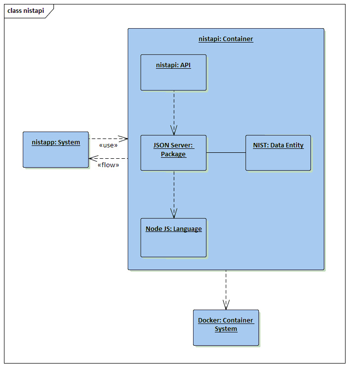

# NIST - Data over Documentation

NIST has a great set of documents that really does establish an incredible foundation
for Security and Privacy. The problem is consuming that documentation and making it
applicable to an enterprise is a herculean task.

To aid in that consumption, I've created an API to at least
make the fundemental data in those documents available programatically.

Current build only has FIPS 200. I will add more data as I tackle the various docs.

For more info on this effort check out my blog: <a href="http://jburer.wordpress.com" target="_blank">http://jburer.wordpress.com</a>

## Architecture

This is an API built with JSON server that makes the NIST data available.



It is designed to be run inside a Docker container, but can be run as a node app as well.

The corresponding app for presentation of that data is here: <a href="https://github.com/jburer/nistapp" target="_blank">https://github.com/jburer/nistapp</a>.

## Docker setup

Clone the repository and move to the nistapp directory.

```
docker build -t <whatever>/nistapp .
docker run -d -p 8080:80 --name nistapp <whatever>/nistapp
```

This will make the app available on

```
http://localhost:8080
```
